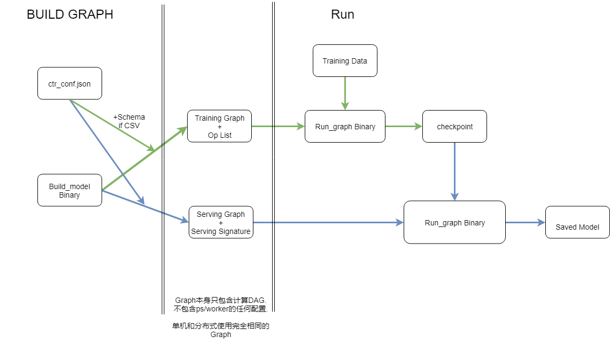

# prerequisites

本地tensorflow版本须和docker镜像中的一致(目前是1.12.0).

以sed2环境为例, 在sed2中build模型, 然后在jupyter上提交训练(jupyter上默认python为3.0, 可以自行调整环境, 这样所有命令都可以在jupyter上运行)

sed2中安装tf 1.12.0

```bash
pip install tensorflow==1.12.0 --user
pip install tensorflow-estimator==1.10.12--user
```

# brief

model producer分为两部分, build model和run model, 构建模型(build_model.bin)和跑模型(load_run.bin)分离.



__目前的配置是可以直接运行的状态, 可以直接训练inet新的基线.

```bash
python deploy_bin.py train inet_v5_dcn_1_jobconfig.yaml
```

或者输出inet v4的saved model

```bash
python deploy_bin.py convert inet_v5_dcn_1_jobconfig.yaml
```

主要解决的点有如下几个:

1. 模型的版本管理. 模型一旦build完成之后, 就可以供任何人训练/复现结果. 可以使用不同模型文件来区分版本.
2. 模型构建和训练完全分离, 分布式训练时, ps数目不再固定, 只要能跑起训练可以按需改动, 例如初始训练用16ps, 日常更新用6ps. (先前训练方式ps数目不可更改, 更改会导致增量训练失败)
3. 模型导出, 现在通过预build的graph在yarn上导出, 只需30秒-1分钟就可以完成.


详细介绍参见下文.

# build_model.bin

build_model.bin包含如下参数, 分别是

1. conf_path: 特征配置的路径, feature conf path
2. model_type: 模型类型, training或serving
3. o: 输出文件的路径
4. training_data_format: 训练数据类型, csv或tfrecord, 如果是csv需要指定schema 
5. schema: schema文件路径, 英文半角逗号分隔, 只有training model需要
6. batch_size: 默认500
7. model: base或dcn, base目前仅用于测试

# training

## build graph

```bash
./build_model.bin -conf_path inet_ctr_conf_v4.json -model dcn -model_type training -o inet_training_graph_v4 -training_data_format csv -schema schema -batch_size 500
```

如果数据是gzip格式, 需要加上```-compression_type GZIP```参数

构建完成之后本地会有两个文件: inet_training_graph_v4和inet_training_graph_v4_op_list. (根据-o所传的参数生成).
训练之前需要把这两个文件放到hdfs上, 训练时才能访问到. 同时在要deploy_bin.py中配置对应的路径.

## training on yarn

配置jobconfig: 参考以下格式创建一个demo.yaml文件

```yaml
working_dir: "hdfs://yiran-data-ns/user/search/rank_data/tieqiu/ckpts/inet_graph_train_v5_exp_2"

train_and_eval:
    training_path: "hdfs://yiran-data-ns/user/search/rank_data/moning/polaris_streaming/ctr/2019071[1-2]"
    eval_path: "hdfs://yiran-data-ns/user/search/rank_data/moning/polaris_streaming/ctr/20190707"
    graph_path: "hdfs://yiran-data-ns/user/search/rank_data/tieqiu/graphs/inet_train_v5_dcn_3_b500"
    op_info_path: "hdfs://yiran-data-ns/user/search/rank_data/tieqiu/graphs/inet_train_v5_dcn_3_b500_op_list"

export:
    graph_path: "hdfs://yiran-data-ns/user/search/rank_data/tieqiu/graphs/inet_train_v5_dcn_3_serving"
    serving_sig_path: "hdfs://yiran-data-ns/user/search/rank_data/tieqiu/graphs/inet_train_v5_dcn_3_serving_signature_def"
    done_file_path:  "hdfs://yiran-data-ns/user/search/rank_data/tieqiu/saved_models/inet_train_v5_dcn_3/done_list"
    saved_model_dir: "hdfs://yiran-data-ns/user/search/rank_data/tieqiu/saved_models/inet_train_v5_dcn_3"

daily:
    daily_train_path: "hdfs://yiran-data-ns/user/search/rank_data/moning/polaris_streaming/ctr/{:%Y%m%d}"
```

- working_dir: checkpoint和summary保存路径
- train_and_eval: 这部分是训练和评估所需要的
  - training_path: 训练数据路径
  - eval_path: 评估数据路径
  - graph_path: build_model.bin生成的训练graph路径, 可以是hdfs, 也可以直接用本地路径(放到和load_run.bin相同路径)
  - op_info_path: 同graph_path
- export: 这部分是导出模型时需要, 训练时可以不配
  - graph_path: 导出saved model所需要的graph路径, 用 build_model.bin生成
  - serving_sig_path: 同graph_path
  - done_file_path: done_list路径, 必须是hdfs
  - saved_model_dir: saved model保存目录, 必须是hdfs
- daily: 日常训练配置
  - daily_train_path: 日常训练数据路径, 注意最后的日期格式 {:%Y%m%d}, 这是python的日期formatter, 会按当前日期format成对应的格式.


启动训练
```bash
python deploy_bin.py train demo.yaml
```

启动评估
```bash
python deploy_bin.py eval demo.yaml
```

日常训练
```bash
python deploy_bin.py daily_train demo.yaml
```

# serving

## build graph

构建serving模型, serving和training需要用相同的conf.

```bash
./build_model.bin -conf_path inet_ctr_conf_v4.json -model dcn -model_type serving -o inet_serving_graph_v4 -batch_size 500
```

一般情况下构建serving模型只需要用以上命令就可以了, 但是有一种情况需要做一点trick来上线模型.

这个情况是:

1. 训练时feature column的定义是feature名称, 而不是tag
2. 上线的时候要上到pml, 需要用tag serving

这时候要在原有的命令上加上2个参数: use_tag和name_tag_map. use_tag=1表示映射成tag serving, name_tag_map中必须包含所有用到的特征的名称到tag的对应.

```
./build_model.bin -conf_path inet_ctr_conf_v4.json -model dcn -model_type serving -o inet_serving_graph_v4 -batch_size 500 -use_tag 1 -name_tag_map name_tag_map.json
```

构建完成之后本地产生两个文件: inet_serving_graph_v4和inet_serving_graph_signature_def. (根据-o所传的参数生成)
转模型之前需要把这两个文件放到hdfs上. 

## export savedmodel on yarn

```bash
python deploy_bin.py convert demo.yaml
```
